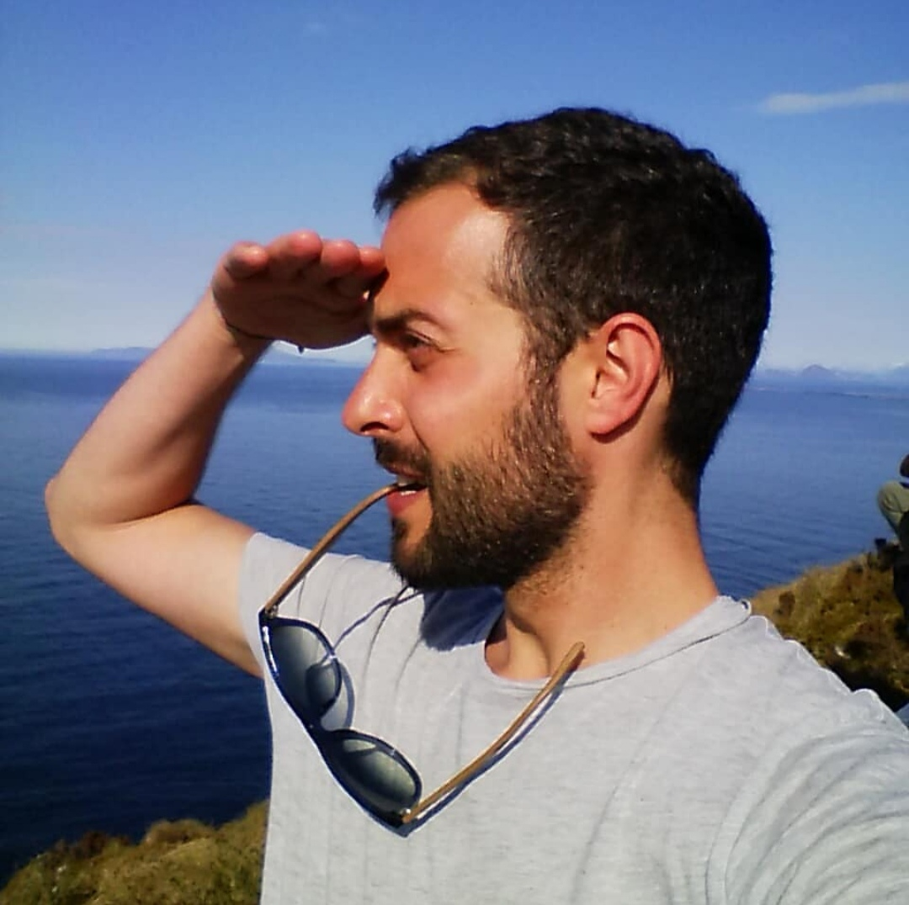

Andrea Cremaschi

## About my work
I am a Research Scientist in Biostatistics at the Singapore Institute for Clinical Sciences (SICS), Agency for Science, Technology and Research (A*STAR), in Singapore.

My research interests include both the methodological and applied aspects of Statistics, particularly within the Bayesian framework.
One of my main interests is Bayesian nonparametrics (BNP), and the use of flexible mixture
models for inference in scenarios where the data present peculiar features. In my recent
works, I focus on modelling data presenting deviation from Gaussianity and a sparse
dependence structure, group-specific dependencies, as well as the flexible inclusion covariate of
mixed types in the model. 
Other research interests are model-based cluster analysis, graphical models, multiple response analysis and item-response theory.

## Selected Publications

**Cremaschi A**, De Iorio M, Kothandaraman N, Yap F, Tint MT and Eriksson J (2023) Joint modelling of association networks and longitudinal biomarkers: an application to child obesity. _Statistics in Medicine_ - in publication.

Kee MZL, **Cremaschi A**, De Iorio M, Chen H, Montreuil T, Nguyen TV, Côté SM, O’Donnell KJ, Giesbrecht GF, Letourneau N, Chan SY and Meaney MJ (2023) Perinatal Trajectories of Maternal Depressive Symptoms in Prospective, Community-Based Cohorts across Three Continents. _JAMA Network Open_, 6(10), e2339942-e2339942.

**Cremaschi A**, Argiento R, De Iorio M, Shirong C, Chong YS, Meaney MJ, Kee MZ (2022) Seemingly Unrelated Multi-State processes: a Bayesian semiparametric approach. _Bayesian Analysis_, 1(1), pp.1-23.

Mozdzen A, **Cremaschi A**, Cadonna A, Guglielmi A, Kastner G (2022) Bayesian modeling and clustering for spatio-temporal areal data: an application to Italian unemployment. _Spatial Statistics_, 52, p.100715.

Franzolini B, **Cremaschi A**, Boom WvD and De Iorio M (2022) Bayesian clustering of multiple zero-inflated outcomes. “Bayesian Inference: Challenges, Perspective, and Prospects” issue of _Philosophical Transactions of the Royal Society A_, guest edited by Professor Michael Jordan, Professor Christian Robert and Professor Judith Rousseau.

Molinari M, **Cremaschi A**, De Iorio M, Chaturvedi N, Hughes AD, Tillin T (2022) Bayesian Dynamic Network Modelling: an application to metabolic associations in cardiovascular diseases. _Journal of Applied Statistics_, pp.1-25.

Molinari M, **Cremaschi A**, De Iorio M, Chaturvedi N, Hughes AD, Tillin T (2022) Bayesian nonparametric modelling of multiple graphs with an application to ethnic metabolic differences. _Journal of the Royal Statistical Society: Series C (Applied Statistics)_, 71(5), 1181-1204.

**Cremaschi A**, De Iorio M, Chong YS, Meaney MJ, Kee MZ (2021) A Bayesian nonparametric approach to dynamic item-response modelling: an application to the GUSTO cohort study. _Statistics in Medicine_, 40(27), pp.6021-6037.

Rønneberg L, **Cremaschi A**, Hanes R, Enserink J, Zucknick M (2021) bayesynergy: flexible Bayesian modelling of synergistic interaction effects in in-vitro drug combination experiments. _Briefings in Bioinformatics_, 22(6), p.bbab251.

Wade S, Piccarreta R, **Cremaschi A**, Antoniano-Villalobos I (2021) Colombian Women’s Life Patterns: A Multivariate Density Regression Approach. _Bayesian Analysis_, 17(2), pp.405-433.

Argiento R, **Cremaschi A**, Vannucci M (2019) Hierarchical Normalized Completely Random Measures to Cluster Grouped Data. _JASA_, 1-43.

**Cremaschi A**, Argiento R, Shoemaker K, Peterson C, Vannucci M (2019) Hierarchical Normalized Completely Random Measures for Robust Graphical Modeling. _Bayesian Analysis_ (honourable mention in Lindley prize 2019), 1-31.

Argiento R, **Cremaschi A**, Guglielmi A (2014) A “Density-Based” Algorithm for Cluster Analysis Using Species Sampling Gaussian Mixture Models. _Journal of Computational and Graphical Statistics_, 23(4), 1126-1142. DOI: 10.1080/10618600.2013.856796

## Pipeline

**Cremaschi A**, Wertz T, De Iorio M. Repulsion, Chaos and Equilibrium in Mixture Models arXiv preprint arXiv:2306.10669.

**Cremaschi A**, Cadonna A, Guglielmi A, Quintana F. “A change-point random partition model for large spatio-temporal datasets” arXiv preprint arXiv:2312.12396.

**Cremaschi A**, Yang W, De Iorio M, Evans WE, Yang JJ and Rosner GL. Bayesian modelling of response to therapy and drug-sensitivity in acute lymphoblastic leukemia. _Research Square_. doi: 10.21203/rs.3.rs-2542277/v1 

## Research activity @ A*STAR, Singapore
The work I am conducting at A*STAR focuses on the implementation of advanced, often semi-parametric, Bayesian models to real-life data applications. In particular, I am interested in studying challenging datasets, involving mixed-type responses, covariates and time dynamics. In this framework, the application of Bayesian nonparametric models allows for a more flexible fitting. The focus of my work is on detection of modifiable factors for early intervention, by analysisng data from large cohorts involving children and their parents. The aspects I mostly focus on are transaltional neuroscience, metabolomics and child development.
I am also interested in the cost-effectiveness analysis of intervention strategies in the framework of Health Economics.

## PostDoc activity @ UiO, Oslo
The three PostDoc years in Oslo have been pivotal in building my research interests. There, I have been able to learn a lot about Biostatistics and real-life data applications, and often had the possibility to participate by providing useful statistical insights to the study.
In close collaboration with the Institute for Cancer Research and the Norwegian Centre for Molecular Medicine (NCMM), I focused on the analysis of dose-response data derived from cancer patients. In particular, my main project revolved around the study of drug-drug combination experiments, i.e. _in-vitro_ assays in which multiple drugs are tested simultaneously. The aim of the study is to quantify the differential effect emerging from such experiments via the specification of suitable statistical models. 

## Curriculum Vitae
[Here](https://github.com/AndCre87/andreacremaschi.github.io/raw/master/CV_Cremaschi.pdf) you can find my full CV.

## Contact
**Email**: andreacremaschi87@gmail.com

## ...and a little more
Work is one of my priorities - for sure - but not the only one. I like to keep myself busy with many activities. I often swim, practice yoga and enjoy walking in nature. When climate/season allows, I really like cross-country skiing (something I learnt in Norway!). For more relaxing times, I am a decent cook and enjoy gathering herbs, berries and mushrooms.

     

