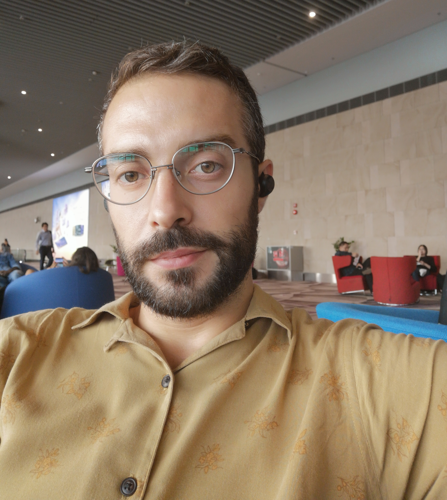
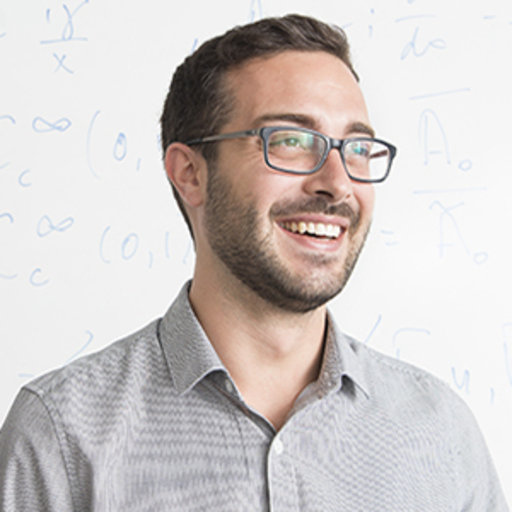
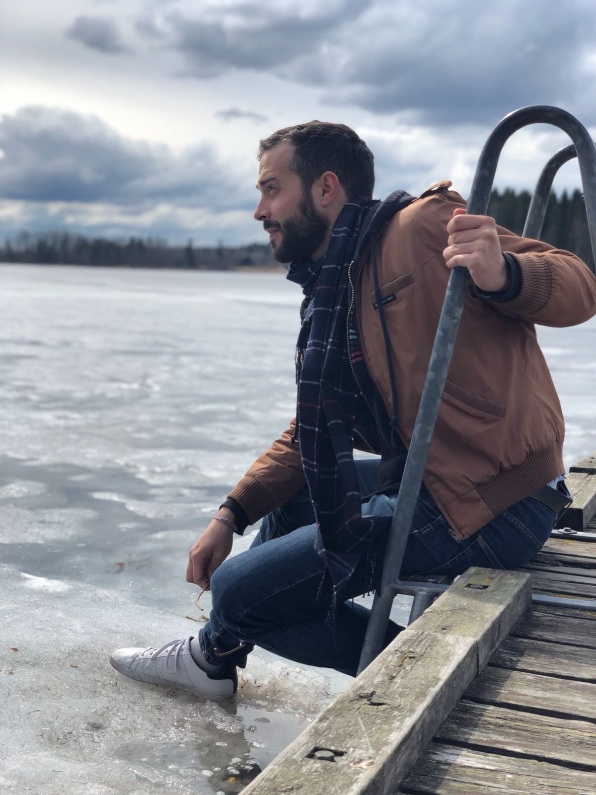

## About me: my work 
I am a PostDoc Fellow in Statistics at Yale-NUS, Singapore.
My research interests include both the methodological and applied aspects of Statistics,
particularly within the Bayesian framework.
One of my main interests is Bayesian nonparametrics (BNP), and the use of flexible mixture
models for inference in scenarios where the data present peculiar features. In my recent
works, I focus on modelling data presenting deviation from Gaussianity and a sparse
dependency structure, group-specific dependencies, as well as the flexible inclusion covariate of
mixed types in the model. Other research interests concern model-based cluster analysis, and the use of graphical models for inference in dataset characterised by a sparse dependency.

### ...and a little more
Work is one of my priorities - for sure - but not the only one. I like to keep myself busy with many activities. I often swim, spin, do yoga and walk in the nature. When climate/season allows, I really enjoy cross-country skiing (that's something I learnt in Norway!). For more relaxing times, I am a decent cook and love gathering herbs, berries and mushrooms. Here are some more pictures of me.
 |  |  | 

### PostDoc activity @ Yale-NUS, Singapore
The work I am conducting at Yale-NUS focuses on the implementation of advanced, often semi-parametric, Bayesian models to real-life data applications. In particular, we are interestd in studying challenging datasets, involing mixed-type responses and covariates and time dynamics. The application of Bayesian nonparametric models to this challenging work is aimed at providing a more flexible fitting.

### PostDoc activity @ UiO, Oslo
The three PostDoc years in Oslo have been pivotal in building my research interests. There, I have been able to learn a lot about Biostatistics and real-life data applications, and often had the possibility to participate by providing useful statistical insights to the study.
In close collaboration with the Institute for Cancer Research, the Norwegian Centre for Molecular Medicine (NCMM), and the hospitals operating in cancer research, I focused on the analysis of dose-response data derived from cancer patients. In particular, my main project revolved around the study of drug-drug combination experiments, i.e. _in-vitro_ assays in which multiple drugs are tested simultaneously. The aim of the (still ongoing) study is to quantify the differential effect emerging from such experiments via the specification of suitable statistical models. 

### Curriculum Vitae
[Here](https://github.com/AndCre87/andreacremaschi.github.io/raw/master/EuropeCV_Cremaschi.pdf) you can download a pdf version of my CV

### Contact
**Work**: andrea.cremaschi@yale-nus.edu.sg

**Personal**: andreacremaschi87@gmail.com

